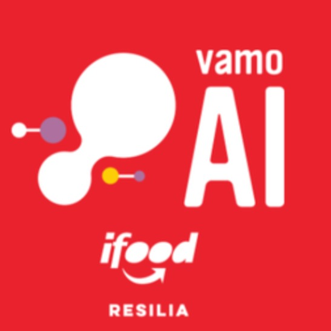
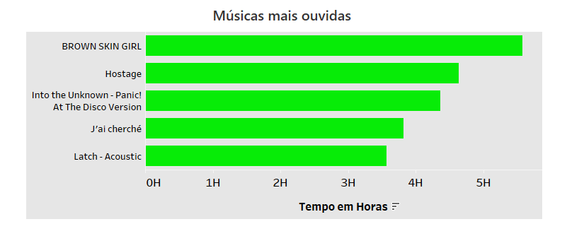
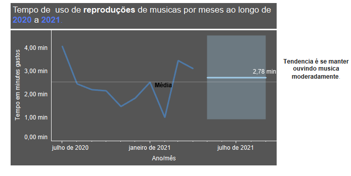

># Projeto Módulo 5

O VamoAI É um projeto do IFood em parceria com a Resília Educação, com o objetivo de desenvolver profissinais em tecnologia em backend com foco em dados

O projeto final contou com o objetivo de mostrarmos nossos conhecimentos em Storytelling e organizamos um material para apresentação conforme as instruções descritas:

- Relacionamento de Dados
- Interatividade
- Diagramação
- Criatividade

> # Base de dados
Cada um pegou as bases de dados dos app's que mais usa e que se sente representado. Assim, teve Spotify, Youtube, Netflix e muitas outras, mas no fim optamos por contar nossas hitórias com uma base de dados cada

> # Nosso contexto

Dessa forma, criamos uma história para falar sobre nós e mostramos um pouco de como consumimos produtos e o nosso perfil de consumidor

> # Visualizaçao de Dados
A nossa vizualizaçõ de dados foi com o Tableu, criamos um dashbord cada e unimos tudo em um só. Logo abixo você pode dá uma olhadinha no que fizemos, mas é só uma prévia ;) 

#### **Github**
 - ### **[Olavo](https://github.com/Olavo5)**
 - ### **[Jheysson](https://github.com/JheyssonDouglas)**
 - ### **[Mateus](https://github.com/mateusvarelo)**

#### **Linkedin**
 - ### **[Olavo](https://www.linkedin.com/in/olavo-pess%C3%B4a/)**
 - ### **[Jheysson](https://www.linkedin.com/in/jheysson-douglas-868342100/)**
 - ### **[Mateus](https://www.linkedin.com/in/mateusvarelo/)**
 > #### Dashboard
 Se curtiu e ficou curioso, dá uma olhada no nosso dashboard **[aqui](https://public.tableau.com/views/CASE-FimdeModulo-Resilia-EducaoPart-1/dash01?:language=pt-BR&:display_count=n&:origin=viz_share_link)**